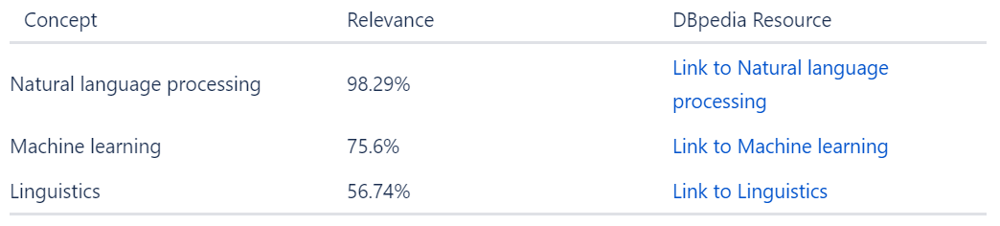
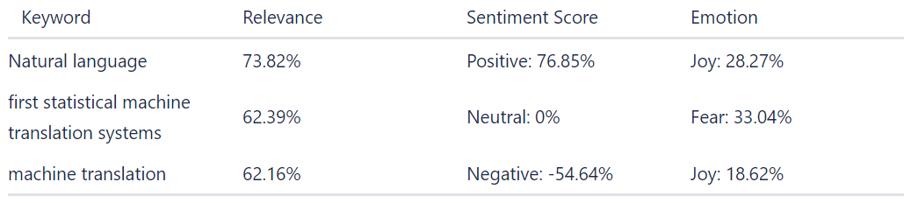
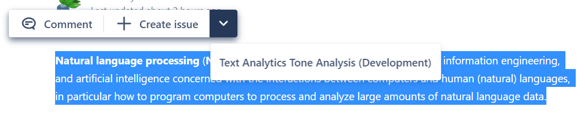
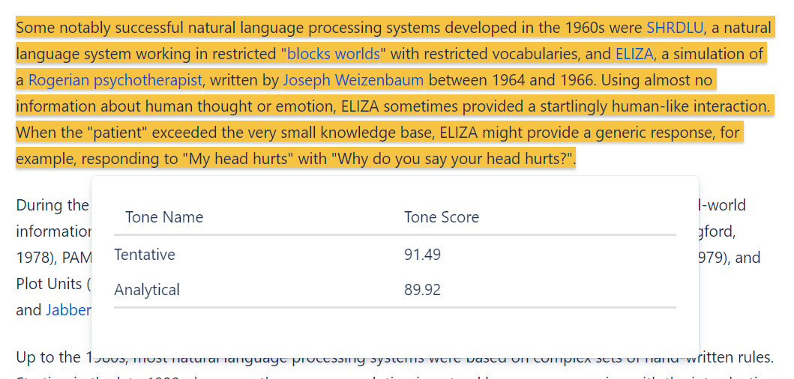
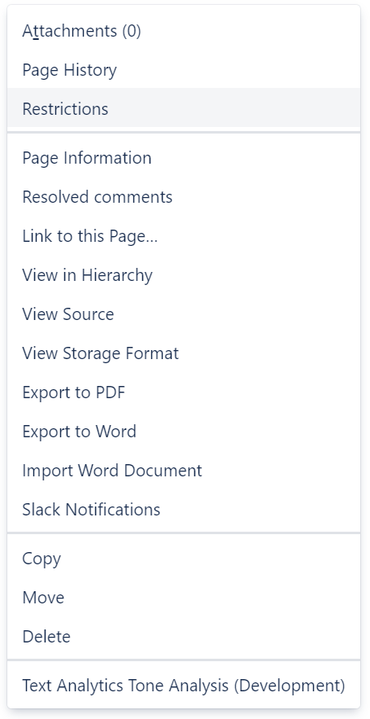
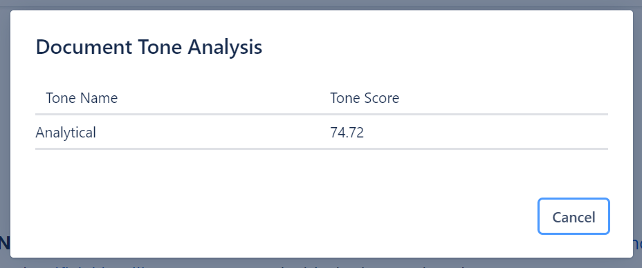

# Forge Text Analytics

This project contains a Forge app written in Javascript that uses the IBM Watson Natural Language Processing APIs for text analytics on Confluence documents.

The app includes four modules:
- Confluence Macro for Concepts
  - Shows the high-level concepts in the content, it's relevance to the document, and a link to the DBpedia resource on the concept


- Confluence Macro for Keywords
  - Shows the important keywords in the content, it's relevance to the document, a sentiment score (positive, neutral, negative), and the emotion associated with the keyword in the content (sadness, joy, fear, disgust, anger)


- Confluence Context Menu
  - Shows the analysis of the emotional and language tones of the selected text



- Confluence Content Action
    - Shows the analysis of the emotional and language tones of the document



## Project

### APIs

The project uses the following APIs:

- IBM Watson Natural Language Understanding
- IBM Watson Tone Analyzer
- Confluence REST API

### Environment Variables

Set environment variables for API keys:

``` bash
$ forge variables:set --encrypt NLU_API_KEY _z-fZ_InIQyIvl5KGaI3hxOXa1QhqQe2uxq4z5QYPyUv
$ forge variables:set --encrypt TA_API_KEY m9d01FszvKRgwGlfow_ci01b0mtGdOVwpoZROgRUASGG
```

## Requirements

See [Set up Forge](https://developer.atlassian.com/platform/forge/set-up-forge/) for instructions to get set up.

## Quick start

- Modify your app by editing the `src/index.jsx` file.

- Build and deploy your app by running:
```
forge deploy
```

- Install your app in an Atlassian site by running:
```
forge install
```

- Develop your app by running `forge tunnel` to proxy invocations locally:
```
forge tunnel
```

### Notes
- Use the `forge deploy` command when you want to persist code changes.
- Use the `forge install` command when you want to install the app on a new site.
- Once the app is installed on a site, the site picks up the new app changes you deploy without needing to rerun the install command.

## Documentation

See [developer.atlassian.com/platform/forge/](https://developer.atlassian.com/platform/forge) for documentation and tutorials explaining Forge.

## Support

See [Get help](https://developer.atlassian.com/platform/forge/get-help/) for how to get help and provide feedback.
